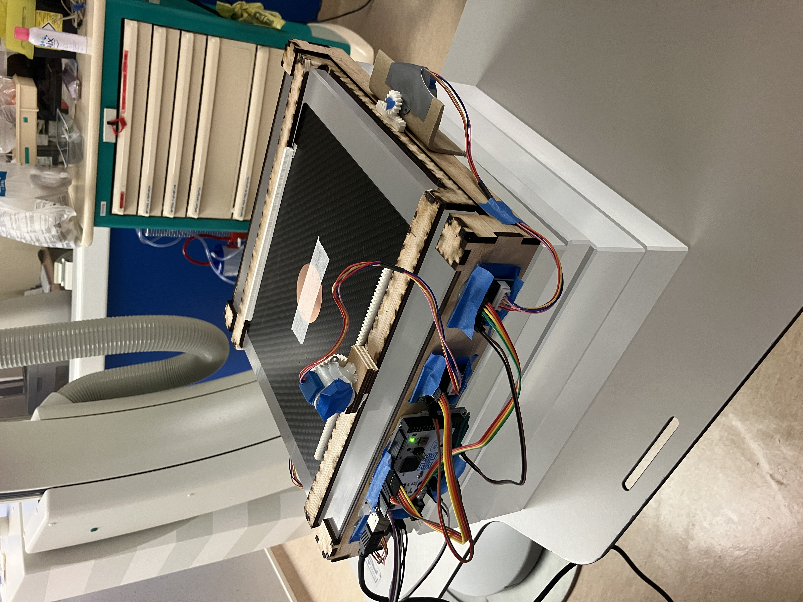
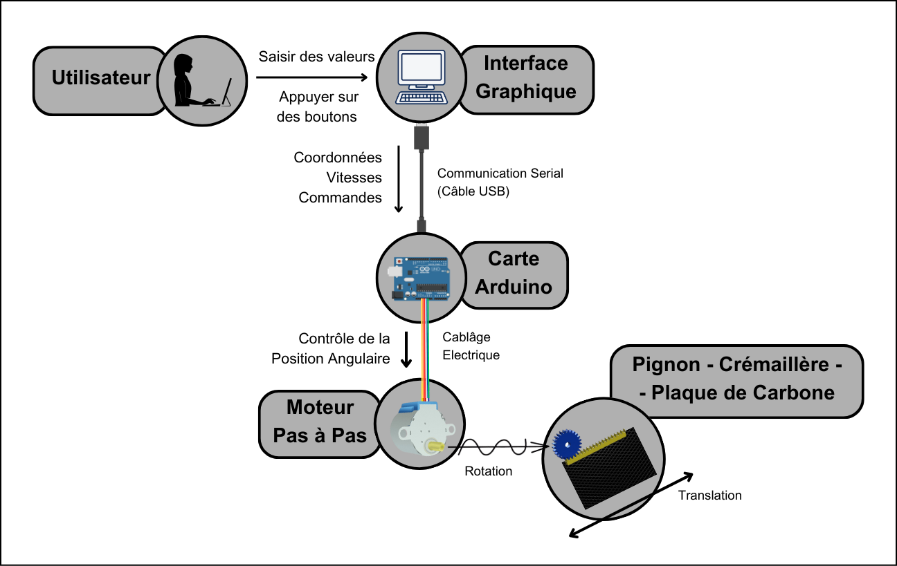

# Moving Phantom for Medical Imaging
This projects provides the code for controlling a robotic system used for testing X-Ray imaging.

The purpose of the robot is to displace a carbon plate in a straight line, with a constant speed. The carbon plate holds a small copper disk, whose position is tracked using X-Ray imaging. The plate can move in 2 axes (X and Y) and is controlled by 3 stepper motors, these ones being controlled by an [Arduino script](controle_mouvement).

The robot also disposes of a [graphical user interface (GUI)](gui) thath allows users to define and manage the robot's route by specifying positions and speeds, and to send commands to the Arduino microcontroller which controls the robot's movement.

The robot is placed on top of a PMMA block, which simulated human tissue in X-Ray imaging. The copper disk represents a target region, for example, a vein in which a catheter would be inserted during an interventional radiology (IR) procedure. In the picture below you can see the robot being used for an actual imaging test.

## Hardware Overview
The robot is composed of two pieces of wooden suport. 2 stepper motors are placed in opposite sides of the phantom, controlling the Y-axis movement, and the other one is placed on top, attached to the carbon plate and controlling the X-axis movement. The stepper motors are orchestrated by an Arduino MEGA which interprets the user commands received from the GUI.

