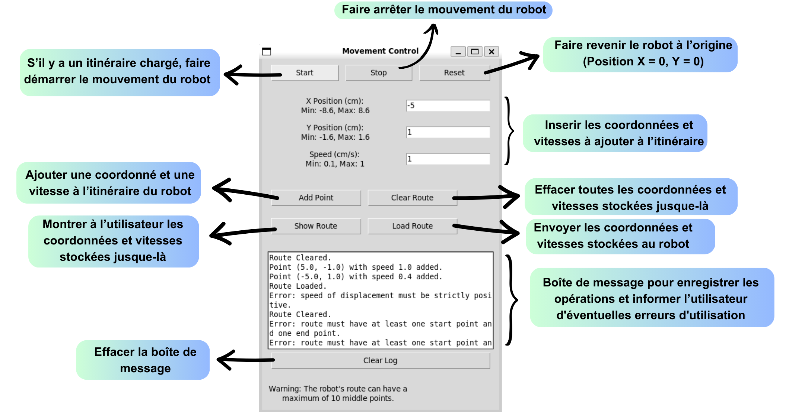
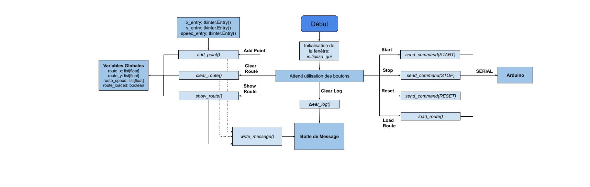

# GUI-Based Robot Control System

The [Python file](gui.py) in this directory provides a graphical user interface (GUI) for controlling a robotic system. The GUI allows users to define and manage the robot's route by specifying positions and speeds, and to send commands to an Arduino microcontroller which controls the robot's movement.

## Installation

1. Clone this repository:
   ```bash
   git clone https://github.com/lammour/moving-phantom.git
   cd moving-phantom
   ```

2. Install required libraries:
    ```bash
    pip install pyserial tkinter
    ```

3. Connect your Arduino to the system. Update the COM port in the code, line 20:
    ```python
    ser = serial.Serial('COM4', 9600, timeout=1)  # Replace 'COM4' with your Arduino's port
    ```
    You can check in which port your Arduino is connected on the Device Manager.

4. Run the program:
    ```bash
    python gui.py
    ```
    
## Graphical Interface Overview



1. **Start/Stop/Reset Buttons**:
- Control the robot's movement.
- "Start": Initiates movement IF there is a loaded route.
- "Stop": Halts movement.
- "Reset": Resets the robot's position to the origin.

2. **Position and Speed Inputs**:
- Enter X and Y coordinates (in cm) and speed (in cm/s).
- Pay attention to the displayed limits.

3. **Route Management**:
- "Add Point": Adds a new point to the route.
- "Clear Route": Clears all points in the current route.
- "Show Route": Displays the route details.
- "Load Route": Sends the route to the Arduino.

4. **Message Log**:
- Displays system updates, errors, and warnings.
- "Clear Log": Clears the message log.

## Code Overview



### Global Variables
- `route_x`, `route_y`, `route_speed`: Store the coordinates and speeds of the route.
- `route_loaded`: Indicates whether a route has been loaded. This is set to false when you modify the route, even if it was previously loaded.
- `message_box`: Displays logs and feedback.

### Main Functions
1. **Route Management**:
- `add_point()`: Adds a point to the route after validation.
- `clear_route()`: Clears the current route.
- `show_route()`: Displays the current route in the log.
- `load_route()`: Sends the route to the Arduino.

2. **Control Commands**:
- `start_movement()`: Starts the robot's movement.
- `stop_movement()`: Stops the robot's movement.
- `reset_position()`: Resets the robot's position.

3. **GUI Initialization**:
- `initialize_gui()`: Sets up the interface with buttons, inputs, and message areas.

4. **Serial Communication**:
- `send_command(command)`: Sends a command to the Arduino via Serial.

## Usage
General system workflow:
1. Specify positions, speeds, and add points to the route.
2. Use "Load Route" to send the route to the Arduino.
3. Start the robot's movement with the "Start" button.
4. Monitor the log for warnings or errors.
5. Stop or reset the robot as needed.

Example:
- X = 5, Y = -1, Speed = 0.5
- Click "Add Point".
- X = -5, Y = 1, Speed = 0.5
- Click "Add Point".
- Click "Load Route".
- Click "Start".
- Click "Stop" when desired, followed by "Reset".